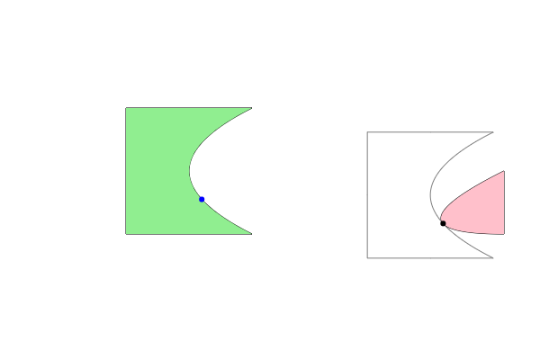

# bezier_geometry
Intersection and collision detection for shapes consisting of quadratic Bézier curves.
## Requirements
Initial generation of makefiles can be done by opening the project in [NetBeans](https://netbeans.apache.org/front/main/index.html) after installing the CPPLite plugin:

This will allow for convenient editing in isolation in addition to the use of preconfigured unit tests. However, all code is standard C++11, and may also be included in any project as simple source and header files.
## Contributing
The code format uses the LLVM clang-format style:

    clang-format --style=LLVM -i $(find . -type f -name "*.cpp" -o -name "*.hpp")

## Basic Usage
This module provides several useful functions (see the code documentation), but the most interesting is 2D collision detection. A 2-dimensional shape, modelled as a spline of quadratic Bézier curves, can calculate the results of 2 fundamental types of movement: shifts and rotations. A shift is when a shape is to be moved in a straight line for any direction; a rotate is when a shape is rotated about a point in any direction (clockwise/counterclockwise). When simulating physical objects, generally it is important to perform 'collision detection', determining that a moving shape has contacted another moving shape and the details of such contact. Unlike many other collision detection methodologies, this module does not rely on checking for overlaps after moving (potentially causing inconsistent results, depending on granularity/framerate), the use of bounding boxes/octagons, or approximating curves as a set of line segments. Instead, it can symbolically evaluate curves to deterministically calculate distances and initial points of contact with predictable performance and accuracy.

### Shifting
A simple example of constructing shapes and performing a 'shift' calculation is as follows:

    // The green shape.
    const bezier_geometry::Shape moving(
      {
        bezier_geometry::Point2D(100, 100),
        bezier_geometry::Point2D(100, 200),
        bezier_geometry::Point2D(200, 200),
        bezier_geometry::Point2D(200, 100)
      },
      {
        bezier_geometry::Point2D(100, 150),
        bezier_geometry::Point2D(150, 200),
        bezier_geometry::Point2D(100, 150),
        bezier_geometry::Point2D(150, 100)
      });
    // The red shape.
    const bezier_geometry::Shape stationary(
      {
        bezier_geometry::Point2D(400, 100),
        bezier_geometry::Point2D(400, 150)
      },
      {
        bezier_geometry::Point2D(400, 125),
        bezier_geometry::Point2D(300, 100)
      });
    bezier_geometry::Shape::ShiftAgainstResult result;
    moving.shiftAgainst(
      stationary,
      -0.1, // Mostly horizontal, sloping downwards slightly.
      true,
      true,
      result);
    // How far the moving shape could move along the input direction before being 'blocked'.
    std::cout << "Distance to block: " << result.movingEdgeResult.distance << std::endl;
    std::cout << "Moving edge param: " << result.movingEdgeResult.param << std::endl;
    // Blue dot. The point on the moving shape where it will be blocked by the stationary shape.
    std::cout << "Moving blocked point: " << result.movingEdge->valueAt(result.movingEdgeResult.param) << std::endl;
    std::cout << "Stationary edge param: " << result.movingEdgeResult.inputParam << std::endl;
    // Black dot. The point on the stationary shape where it will block the stationary shape.
    std::cout << "Stationary blocked point: " << result.stationaryEdge->valueAt(result.movingEdgeResult.inputParam) << std::endl;

The output of the above code snippet:

    Distance to block: 192.503
    Moving edge param: 0.725178
    Moving blocked point: (160.14098358878544559047, 127.48224746029765697131)
    Stationary edge param: 0.591896
    Stationary blocked point: (351.68897042756253767948, 108.32744877641994207806)

In the below diagram, the two shapes are illustrated as well as their respective blocked/blocking points. An outline of the result of shifting the moving in the direction by the distance calculated is also included to indicate that this is indeed the correct blocking point.

### Rotating
TODO