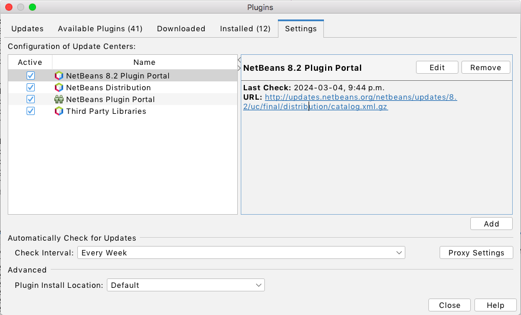
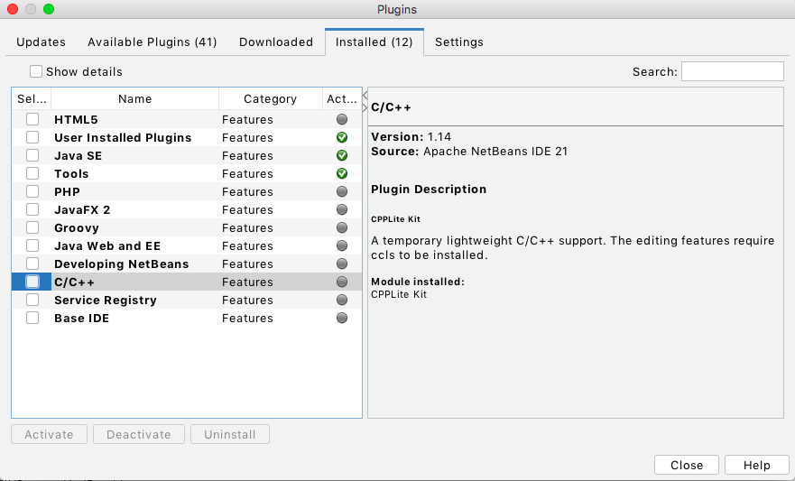

# bezier_geometry
Intersection and collision detection for shapes consisting of quadratic Bézier curves.
## Requirements
Initial generation of makefiles can be done by opening the project in [NetBeans](https://netbeans.apache.org/front/main/index.html) after installing the CPPLite plugin:

This will allow for convenient editing in isolation in addition to the use of preconfigured unit tests. However, all code is standard C++11, and may also be included in any project as simple source and header files.
## Contributing
The code format uses the LLVM clang-format style:

    clang-format --style=LLVM -i $(find . -type f -name "*.cpp" -o -name "*.hpp")
